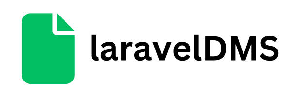

# Laravel Document Management System

The **Laravel Document Management System** (DMS) is a powerful and flexible open-source solution for managing and organizing documents within your organization. It is built on top of the Laravel PHP framework, providing a robust and customizable platform for document storage, retrieval, and collaboration.

## Features

- **User Authentication**: Securely manage user access with role-based permissions.
- **Document Upload**: Upload documents of various formats, including PDF, Word, Excel, and more.
- **Folder Organization**: Create and manage folders to organize your documents efficiently.
- **Search**: Quickly search and retrieve documents using keywords and filters.
- **Version Control**: Maintain a history of document revisions and track changes.
- **Collaboration**: Share documents with colleagues and collaborate in real-time.
- **Access Control**: Define who can view, edit, and delete documents and folders.
- **Notifications**: Get notified about document updates, comments, and other activities.
- **API Integration**: Integrate with other applications through RESTful APIs.
- **Customizable**: Easily customize and extend the system to meet your specific requirements.

# Document and Template Routes

Within a Laravel application, these routes are designed to manage documents and templates within a specific team. The routes are organized into different actions for listing, adding, updating, and removing documents and templates, as well as managing inputs within templates.

## List Documents and Templates

- `GET /team/{team}/documents`: Retrieve a list of documents associated with a specific team.
- `GET /team/{team}/templates`: Retrieve a list of templates associated with the same team.

## Add Document and Template

- `POST /team/{team}/documents/add`: Add a new document to the team. Provide the necessary document data in the request.
- `POST /team/{team}/templates/add`: Add a new template to the team. Provide the necessary template data in the request.

## Manage a Specific Document (within a team)

- `GET /team/{team}/documents/{document}`: Retrieve detailed information about a specific document.
- `POST /team/{team}/documents/{document}/update`: Update the details of a specific document.
- `POST /team/{team}/documents/{document}/remove`: Remove a specific document from the team.
- `GET /team/{team}/documents/{document}/fields`: Get information about the fields within a specific document.
- `GET /team/{team}/documents/{document}/value`: Get the value of a specific document.
- `POST /team/{team}/documents/{document}/value`: Update the value of a specific document.

## Manage a Specific Template (within a team)

- `GET /team/{team}/templates/{template}`: Retrieve detailed information about a specific template.
- `POST /team/{team}/templates/{template}/update`: Update the details of a specific template.
- `POST /team/{team}/templates/{template}/remove`: Remove a specific template from the team.

## Manage Inputs (within a template)

- `GET /team/{team}/templates/{template}/inputs`: Get a list of inputs associated with a specific template.
- `POST /team/{team}/templates/{template}/inputs/add`: Add a new input to a specific template.
- `GET /team/{team}/templates/{template}/inputs/{input}`: Retrieve detailed information about a specific input within a template.
- `POST /team/{team}/templates/{template}/inputs/{input}/update`: Update the details of a specific input.
- `POST /team/{team}/templates/{template}/inputs/{input}/remove`: Remove a specific input from a template.

These routes are organized to efficiently manage documents and templates within a team, and they are protected by the `auth:sanctum` middleware to ensure that only authenticated users can access them.
